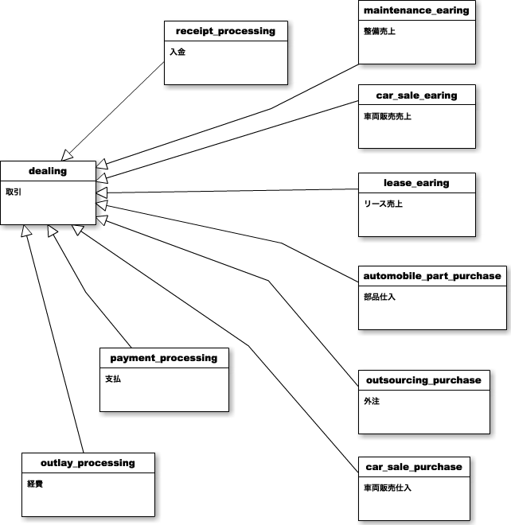

###統合スキーマ案(取引周辺)

債権債務が関係する全てを把握したい
#####案1 (中間モデル使用パターン)

「整備見積、車販売上、リース売上」を「売上」で「部品仕入、外注、車両仕入」を「仕入」でのような中間モデルを使った集計が可能ですがリレーションの把握が難しいかもしれません
https://cacoo.com/diagrams/i1ZUBPtJ7NFWqlMA#672B4 (まだ共有設定はしていません)

#####案2 (中間モデル未使用パターン)

構造は(案1よりもリレーションも含めて比較的シンプルになりますが全ての売上だけの集計、全ての仕入だけの集計の際に手間が掛かります
https://cacoo.com/diagrams/i1ZUBPtJ7NFWqlMA#DA9C2 (まだ共有設定はしていません)